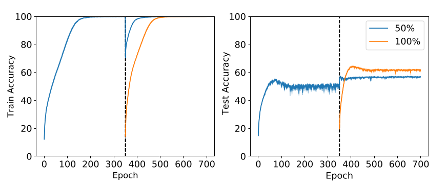

::: {.cell .markdown}
# On Warm-Starting Neural Network Training

The paper is available on [arXiv](https://arxiv.org/abs/1910.08475). In creating the interactive material for this notebook, we utilized the code from this reproducibility challenge: [Re: Warm-Starting Neural Network Training](https://rescience.github.io/bibliography/Kireev_2021.html).
:::

::: {.cell .markdown}
## Goals

At the end of this notebook, you will:

- learn to identify specific claims, both qualitative and quantitative, in a machine learning research paper
- learn to identify the specific experiments they would need to run to validate each claim
- learn to identify the data, code, and hyperparameters needed to run each experiment, and to make appropriate choices when these are not available
- understand the computational cost associated with reproducing a result, and the effect of missing information on that cost.
:::

::: {.cell .markdown}
### While experimenting we need to answer some questions to understand the level of reproducibility of this paper:

-   Is there code available for training? for inference?
-   Is it author code, or written by someone else? Are there multiple implementations available?
-   What framework and version was used? Are all the functions are still available or should you make some changes?
-   Did the author compare to other models that are not implemented in the code? Are these models available?
-   Are all hyperparameters for all experiments available? If not, what is the sensitivity of each hyperparameter?
-   Was the initial values set at random?
-   Are the datasets used available? Are there any modifications done to the data?
-   Did our results match that of the original paper?
:::

::: {.cell .markdown}
## Introduction

Warm starting and cold starting are two different ways of initializing the weights of a neural network before training. <b>Cold starting</b> means starting with random weights, while <b>warm starting</b> means starting with weights copied from a previously trained model. In our context the model is previously trained on a subset of the same dataset.

Updating datasets over time can be a costly endeavor, making it impractical to retrain models from scratch each time. Therefore, warm-starting becomes crucial as it allows leveraging pre-trained weights on a subset of the data, significantly reducing the time and resources required for training. By utilizing warm-starting, models can be efficiently adapted to incorporate new data without incurring the high computational expenses associated with starting from scratch.
:::

::: {.cell .markdown}
## Primary Claims:
The original paper makes several claims that can be classified as either quantitative or qualitative. Read the following claims carefully to be able to conduct the right experiment.

***
:::

::: {.cell .markdown}
<p style="color: crimson;font-size: 16px;"> Which model do you expect to have a better generalization performance (Test accuracy): <br>
    <p style="display:inline-block;margin-top:0.5em;margin-left: 2em; color:crimson;font-size: 16px;">
        1- Model that uses the weights from a previous model trained on a subset of the data (Warm-starting). <br>
        2- Model that starts with random weights (Cold-starting). 
    </p>
</p>
:::

::: {.cell .markdown}
<p style="color: green; font-size: 16px;"> Answer: </p>

***
:::

::: {.cell .markdown}
### Claim 1: Warm-starting neural network training may result in lower validation accuracy than random initialized models, despite having similar final training accuracy.
 
*We compare a warm-starting ResNet-18 model (Blue) and a randomly initialized ResNet-18 model (Orange) on the CIFAR-10 dataset. The warm-starting model first trains on 50% of the data for 350 epochs, then both models train on the full dataset for another 350 epochs. The figure shows that both models overfit the training data, but the randomly initialized model achieves higher test accuracy.*

- Excerpt: 

> "However, warm-starting seems to hurt generalization in deep neural networks. This is particularly troubling because warm-starting does not damage training accuracy."

- Type: This claim is qualitative because it states that the warm-start model has worse generalization performance than the fresh-start model, without stating a clear numerical evidence.
- Experiment: A possible way to evaluate this claim is to use some unseen validation data and compare the performance of the two models using different metrics, such as accuracy, precision, recall, or others. You can also try different model architectures and datasets to test the claim’s robustness.

***
:::

::: {.cell .markdown}
### Claim 2: Warm-started models had worse test accuracies than randomly initialized models on CIFAR-10, SVHN, and CIFAR-100, using ResNet-18 and MLP.
[comment1]: <> ()

| CIFAR-10    | ResNet-SGD | ResNet-Adam | MLP-SGD | MLP-Adam | CIFAR-100   | ResNet-SGD | ResNet-Adam | MLP-SGD | MLP-Adam |    SVHN     | ResNet-SGD | ResNet-Adam | MLP-SGD | MLP-Adam |
| :---------: | :--------: | :---------: |:------: |:-------: | :---------: | :--------: | :---------: |:------: |:-------: | :---------: | :--------: | :---------: |:------: |:-------: |
| Random init |     56.2    |     78.0     |   39.0   |   39.4    |  |    18.2     |     41.4     |   10.3   |    11.6   |   |  89.4      |   93.6      |    76.5 |  76.7    |
| Warm-Start  |    51.7     |    74.4      |  37.4    |    36.1   |   |     15.5    |     35.0     |   9.4   |    9.9   |   |  87.5      |     93.5    |   75.4  |   69.4   |
| Difference  |      4.5   |     3.6     |    1.6  |   3.3    |   |    2.7     |     6.4     |    0.9  |  1.7     |   |      1.9   |    0.1      |   1.1   |    7.3   |


- Excerpt: 

> "Our results (Table 1) indicate that generalization performance is damaged consistently and significantly for both ResNets and MLPs. This effect is more dramatic for CIFAR-10, which is considered relatively challenging to model (requiring, e.g., data augmentation), than for SVHN, which is considered easier."

- Type: This is a quantitative claim, as it uses numerical values to compare the performance of different models on different datasets.
- Experiment: To verify this claim, you will need to follow the authors’ details and train the models mentioned. Then, you will need to compare their test accuracies. However, some of the accuracy differences are very small, especially for the SVHN dataset. Therefore, reproducing these results may be difficult without the authors’ hyperparameters.

***
:::

::: {.cell .markdown}
<p style="color: darkblue; font-size: 16px;"> In most cases it is a reasonable strategy to warm-start the model and potentially achieve quicker convergence. As it would be inefficient to discard the old model that has already learned something.</p>

***
:::

::: {.cell .markdown}
<p style="color: crimson;font-size: 16px;"> Do you think warm-starting models will take more or less training time than random initialized models?</p>
:::

::: {.cell .markdown}
<p style="color: green; font-size: 16px;"> Answer: </p>

***
:::

::: {.cell .markdown}
### Claim 3: Warm-starting neural networks saves resources and time, but lowers accuracy by 10% compared to fresh models.
\
*The data is divided into 1000-sample batches for online training. The warm-started (Blue) and randomly initialized (Orange) models train until 99% training accuracy. The plots show how training time and test accuracy vary with the number of samples.*

- Excerpt:

> “Nevertheless, it is highly desirable to be able to warm-start neural network training, as it would dramatically reduce the resource usage associated with the construction of performant deep learning systems.”

- Type: This claim is quantitative because it compares relation between the training time and mechanism used for initialization of weights. The figure also shows that there is more than a 10% difference in test accuracy given a certain training accuracy threshold ( 99% ).
- Experiment: A possible way to test this claim is to run an online training experiment with model; one of them should initialized using the old version and the other with random initialization each time and compare there test accuracies at the end.

***
:::

::: {.cell .markdown}
**Based on your understanding of the previous claims, answer the following question.**
:::

::: {.cell .markdown}
<p style="color: crimson;font-size: 16px;"> You have a trained model for a classification project. The dataset has 10,000 new samples. Your team wants to use the new data. One option is to retrain the model from scratch. Another option is to warm-start the model with the current weights. Which option do you prefer? Give a brief reason for your choice. </p>
:::

::: {.cell .markdown}
<p style="color: green; font-size: 16px;"> Answer: </p>

***
:::

::: {.cell .markdown}
## Experiments

In this section, we will test the claims made by the authors. You will come across sections in the code marked with `#TODO`, where you need to fill an argument as described in the experiment description.

***
:::

::: {.cell .markdown}
### Experiment 1:
In this experiment we want to compare two ways of training a ResNet-18 model, which is a type of deep neural network that can classify images. The CIFAR-10 dataset is a collection of 60,000 color images of 10 classes, such as airplanes, cars, and dogs. The experiment splits the dataset into two parts: a training set and a test set. The training set is used to update the model weights, and the test set is used to evaluate the model performance.

The experiment uses two models: a warm-starting model and a randomly initialized model. The warm-starting model starts with some pre-trained weights that are learned training on 50% of the training data for 350 epochs. The randomly initialized model starts with random weights that are not learned from any data. Both models train on the full training data for 350 epochs, where one epoch means one pass over the entire data. The experiment will measure the accuracy of the models on both the training and test sets, which is the percentage of correctly classified images.

To run this experiment we will need to:

1. Create `get_cifar10_loaders` function to load the CIFAR-10 dataset and split it into training and test sets.
2. Define a function that takes a model, a data loader, an optimizer, and a loss function, and trains the model for a given number of epochs, saving the model weights after each epoch.
3. Create a ResNet-18 model and train it for 350 epochs on 50% of the training data, using stochastic gradient descent as the optimizer and cross entropy loss as the loss function. Save the final model weights as `half_cifar.pt`.
4. Create another ResNet-18 model and load the weights from `half_cifar.pt`. Train this model for another 350 epochs on the full training data, using the same optimizer and loss function. Save the final model weights as `warm_start_full.pt`.
5. Create a third ResNet-18 model with random weights. Train this model for 350 epochs on the full training data, using the same optimizer and loss function. Save the final model weights as `random_full.pt`.
6. Evaluate the test accuracy of all three models using the test data loader. Plot the accuracy curves of the models over time. Compare the results with those reported in the paper and analyze the differences.
:::

::: {.cell .code}
``` python
import os
import glob
import json
import torch
import numpy as np
import torch.nn as nn
import torch.nn.functional as F
import matplotlib.pyplot as plt
from torch.utils.data import random_split, ConcatDataset
from torchvision import transforms, datasets, models
```
:::

::: {.cell .markdown}
***

The following function is `get_cifar10_loaders` that loads the CIFAR-10 dataset, which consists of 60,000 color images of 10 classes, and returns data loaders for training and testing. The function takes four parameters:

- `use_half_train`: a boolean flag that indicates whether to use only half of the training data or the whole dataset. If this is set to `True`, then the parameter `dataset_portion` is automatically set to 0.5.
- `batch_size`: an integer that specifies the number of images to process in each batch. A larger batch size may speed up the training but also require more memory.
- `dataset_portion`: a double value between 0 and 1 that indicates the portion of the training data to use. For example, if this is set to 0.8, then only 80% of the training data will be used and the rest will be discarded. This parameter is useful for experimenting with different amounts of data or for creating validation splits.
- `drop_last`: a boolean flag that indicates whether to drop the last incomplete batch or not. If this is set to `True`, then the last batch that has less than `batch_size` images will be ignored. This parameter may affect the accuracy of the model depending on how many images are left out.

The function returns a dictionary with two keys: `train_loader` and `test_loader` which can be used to iterate over the training and testing data respectively. The function also downloads the CIFAR-10 dataset from torchvision datasets if it is not already present in the specified directory.
:::

::: {.cell .code}
``` python
def get_cifar10_loaders(use_half_train=False, batch_size=128, dataset_portion=None, drop_last=False):
    """
    This loads the whole CIFAR-10 into memory and returns train and test data according to params
    @param use_half_train (bool): return half the data or the whole train data
    @param batch_size (int): batch size for training and testing
    @param dataset_portion (double): portion of train data
    @param drop_last (bool): flag to drop last incomplete batch

    @returns dict() with train and test data loaders with keys `train_loader`, `test_loader`
    """
    
    # Normalization using channel means
    normalize_transform = transforms.Normalize((0.4914, 0.4822, 0.4465), (0.2023, 0.1994, 0.2010))

    # Creating transform function
    train_transform = transforms.Compose([transforms.ToTensor(), normalize_transform])
        
    # Test transformation function    
    test_transform = transforms.Compose([transforms.ToTensor(), normalize_transform])
    
    # loading data from torchvision datasets
    original_train_dataset = datasets.CIFAR10(root=os.path.join('data', 'cifar10_data'),
                                              train=True, transform=train_transform, download=True)
    original_test_dataset = datasets.CIFAR10(root=os.path.join('data', 'cifar10_data'),
                                             train=False, transform=test_transform, download=True)
    
    # Check half data flag
    if use_half_train:
        dataset_portion = 0.5
        
    # Check if only a portion is required
    if dataset_portion:
        dataset_size = len(original_train_dataset)
        split = int(np.floor((1 - dataset_portion) * dataset_size))
        original_train_dataset, _ = random_split(original_train_dataset, [dataset_size - split, split])
    
    # Creating data loaders
    loader_args = {
        "batch_size": batch_size,
    }

    train_loader = torch.utils.data.DataLoader(
        dataset=original_train_dataset,
        shuffle=True,
        drop_last=drop_last,
        **loader_args)

    test_loader = torch.utils.data.DataLoader(
        dataset=original_test_dataset,
        shuffle=False,
        **loader_args)

    return {"train_loader": train_loader,
            "test_loader": test_loader}
```
:::

::: {.cell .markdown}
*** 

The following function is the `exp1` which trains a ResNet-18 model on the CIFAR-10 dataset and returns the train and test accuracies. The function takes six parameters:

- `title`: a string that specifies the name of the experiment. This is used to create a subdirectory under the `experiments/exp1` directory where the model checkpoints and final weights will be saved.
- `experiment_dir`: a string that specifies the path of the experiment directory. If this is `None`, then the function will use the title parameter to create a default directory name.
- `half`: a boolean flag that indicates whether to use half of the training data or the whole dataset. This is passed to the `get_cifar10_loaders` function that loads the data loaders.
- `lr`: a float value that specifies the learning rate for the stochastic gradient descent optimizer.
- `checkpoint`: a string that specifies the path of a model checkpoint file. If this is not `None`, then the function will load the model weights from the checkpoint file and resume training from there.
- `epochs`: an integer that specifies the number of epochs to train the model for.

The function returns a tuple of two lists: `train_acc` and `test_acc`. These are lists that contain the train and test accuracies for each epoch, respectively. The function uses the [ResNet18](https://pytorch.org/vision/main/models/generated/torchvision.models.resnet18.html) model from the torchvision models. The function also sets the random seeds for reproducibility. The function uses cross entropy loss as the loss function and SGD as an optimizer. The function also uses a helper function called get_accuracy to compute the accuracy of the model predictions.
:::

::: {.cell .code}
``` python
# Function takes predictions and true values to return accuracies
def get_accuracy(logit, true_y):
    pred_y = torch.argmax(logit, dim=1)
    return (pred_y == true_y).float().mean()

# Function to train the model and return train and test accuracies
def exp1(title='', experiment_dir=None, half = False, lr = 0.001, checkpoint = None, epochs = 10):
    # Create experiment directory name if none
    if experiment_dir is None:
        experiment_dir = os.path.join('experiments/exp1', title)

    # make experiment directory
    os.makedirs(experiment_dir, exist_ok=True)

    # Set the seed
    torch.manual_seed(42)
    np.random.seed(42)

    # Check if GPU is available
    if torch.cuda.is_available():
        device = torch.device('cuda:0')
        print("CUDA Recognized")
    else:
        device = torch.device('cpu')

    # Get the dataset
    loaders = get_cifar10_loaders(use_half_train=half)
    num_classes = loaders.get('num_classes', 10)

    # Get the model
    model = models.resnet18(num_classes=10).to(device)

    # Create the optimizer
    optimizer = torch.optim.SGD(model.parameters(), lr=lr)

    # Create the loss function
    criterion = torch.nn.CrossEntropyLoss()

    # Get model from checkpoint
    if checkpoint is not None:
        model.load_state_dict(torch.load(checkpoint, map_location=device)['model'])

    # Arrays to hold accuracies
    test_acc = [0]
    train_acc = [0]

    # Train the model
    for epoch in range(1, epochs + 1):
        model.train()
        print(f"Epoch {epoch}")
        accuracies = []
        losses = []

        for batch_idx, (data_x, data_y) in enumerate(loaders["train_loader"]):
            data_x = data_x.to(device)
            data_y = data_y.to(device)

            optimizer.zero_grad()
            model_y = model(data_x)
            loss = criterion(model_y, data_y)
            batch_accuracy = get_accuracy(model_y, data_y)
            loss.backward()
            optimizer.step()

            accuracies.append(batch_accuracy.item())
            losses.append(loss.item())


        train_loss = np.mean(losses)
        train_accuracy = np.mean(accuracies)
        train_acc.append(train_accuracy*100)

        print("Train accuracy: {} Train loss: {}".format(train_accuracy, train_loss))

        accuracies = []
        losses = []
        model.eval()
        for batch_idx, (data_x, data_y) in enumerate(loaders["test_loader"]):
            data_x = data_x.to(device)
            data_y = data_y.to(device)

            model_y = model(data_x)
            loss = criterion(model_y, data_y)
            batch_accuracy = get_accuracy(model_y, data_y)

            accuracies.append(batch_accuracy.item())
            losses.append(loss.item())

        test_loss = np.mean(losses)
        test_accuracy = np.mean(accuracies)
        test_acc.append(test_accuracy*100)
        print("Test accuracy: {} Test loss: {}".format(test_accuracy, test_loss))


    torch.save({
        'model': model.state_dict()
    }, os.path.join(experiment_dir, 'final.pt'))
    
    # return the accuracies
    return train_acc, test_acc
```
:::

::: {.cell .markdown}
***

You should fill the following cell with values that will be used for running the experiment. You can refer to the experiment description above to choose the correct values.

:::

::: {.cell .code}
``` python
# TODO: put the correct values for the following parameters

# Set the number of epochs for all experiments
num_epochs = 

# Train on half of the CIFAR-10 dataset
half_cifar_title =          # You can choose any title
use_half_data = 
half_cifar_lr = 
half_cifar_checkpoint = 

# Train a warm-started model on the full dataset
warm_start_title = 
use_half_data2 = 
warm_start_lr = 
warm_start_checkpoint = 

# Train a randomly initialized model on the full dataset
full_cifar_title = 
use_half_data3 = 
full_cifar_lr = 
full_cifar_checkpoint =  
```
:::

::: {.cell .code}
``` python
# Solution

# Set the number of epochs for all experiments
num_epochs = 350

# Train on half of the CIFAR-10 dataset
half_cifar_title = "half_cifar"  
use_half_data = True
half_cifar_lr = 0.001
half_cifar_checkpoint = None

# Train a warm-started model on the full dataset
warm_start_title = "warm_start"
use_half_data2 = False
warm_start_lr = 0.001
warm_start_checkpoint = 'experiments/exp1/{}/final.pt'.format(half_cifar_title);

# Train a randomly initialized model on the full dataset
full_cifar_title = "full_cifar"
use_half_data3 = False
full_cifar_lr = 0.001
full_cifar_checkpoint = None 
```
:::

::: {.cell .markdown}
***

The following cell trains the three required models. This cell can take some time to run!
:::

::: {.cell .code}
``` python
# Run the exp1 function to get train and test accuracies for each model
half_cifar_train_acc, half_cifar_test_acc = exp1(title=half_cifar_title, half=use_half_data, lr=half_cifar_lr, checkpoint=half_cifar_checkpoint, epochs=num_epochs)
warm_start_train_acc, warm_start_test_acc = exp1(title=warm_start_title, half=use_half_data2, lr=warm_start_lr, checkpoint=warm_start_checkpoint, epochs=num_epochs)
full_cifar_train_acc, full_cifar_test_acc = exp1(title=full_cifar_title, half=use_half_data3, lr=full_cifar_lr, checkpoint=full_cifar_checkpoint, epochs=num_epochs)
```
:::

::: {.cell .markdown}
***

Now we save the training and test accuracies in a dictionary and save it in `runs.json`.
:::

::: {.cell .code}
``` python
# Save all results in a dictionary
runs = {
    half_cifar_title : [half_cifar_train_acc, half_cifar_test_acc, 0],
    warm_start_title : [warm_start_train_acc, warm_start_test_acc, 1],
    full_cifar_title : [full_cifar_train_acc, full_cifar_test_acc, 1]
}

# Save the outputs in a json file
with open("experiments/exp1/runs.json", "w") as f:
    json.dump(runs, f)
```
:::

::: {.cell .markdown}
***

Let’s visualize the accuracies and analyze the outcomes! Run the next cell to plot the accuracies.
:::

::: {.cell .code}
``` python
# Read from json file
with open("experiments/exp1/runs.json", "r") as f:
    runs = json.load(f)

plt.figure()
for title, vals in runs.items():
    offset = epochs * vals[2]
    x = np.arange(offset, offset + len(vals[0]))
    y = vals[0]
    plt.plot(x, y, label=title)
plt.legend()

plt.ylabel(" Train accuracy ")
plt.ylim(0, 100)
plt.plot([epochs, epochs], plt.gca().get_ylim(), '--', c='black')
plt.savefig("fig1_train.pdf")

# Plot test
plt.figure()
for title, vals in runs.items():
    offset = epochs * vals[2]
    x = np.arange(offset, offset + len(vals[1]))
    y = vals[1]
    plt.plot(x, y, label=title)
plt.legend()

plt.ylabel(" Test accuracy ")
plt.ylim(0, 100)
plt.plot([epochs, epochs], plt.gca().get_ylim(), '--', c='black')
plt.savefig("fig1_test.pdf")
```
:::

::: {.cell .markdown}
## Explaining the results

In this section we will answer the questions in the begining of the notebook and maybe leave some room for the student to add his answers
:::
